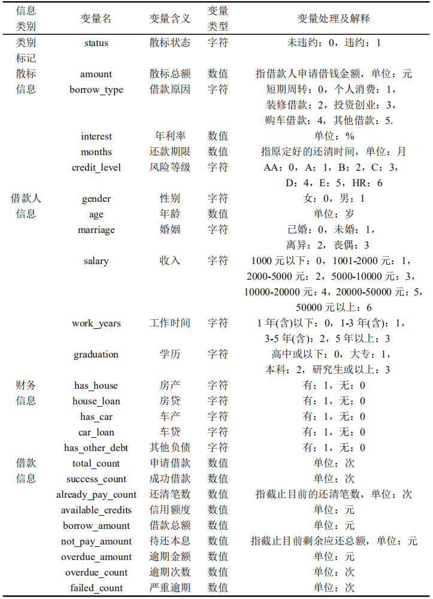
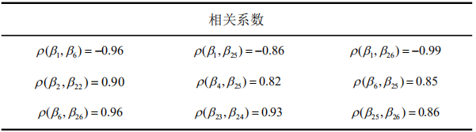
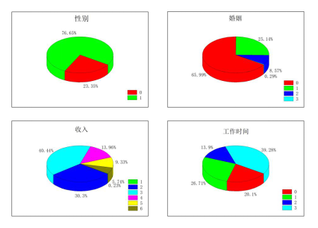
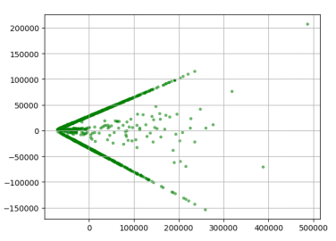
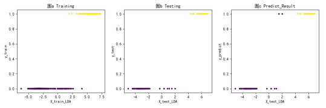
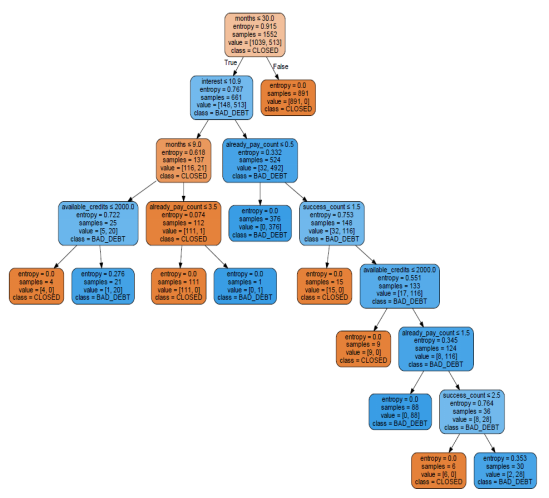
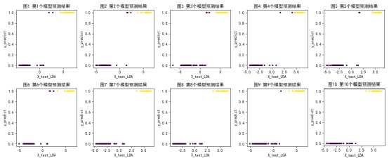
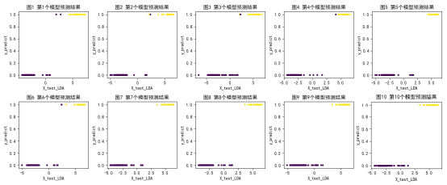

 # **基于机器学习算法的网络信贷风险评估**

***注：1. 本文源自笔者 2020年本科毕业论文，已收录在兰州大学图书馆。本文旨在分享学习，请勿作他用。***

***2. 因为 github不支持某些特殊符号与数学公式，所以会导致相关公式无法正常显示问题，如有需要，可以克隆本文档于 MarkDown 编辑器访问查看，或下载对应PDF格式文档查看 .***

## **目	录**

一、项目背景		

二、数据来源和处理	

* 数据来源	

* 数据处理	

三、实证分析	

* PCA	

* 模型应用	
  * 线性判别分析	
  * 决策树	
  * 支持向量机	
  * LDA算法改进	

* 模型性能对比	

参考文献	

## 一、**项目背景**

近年来，互联网行业蓬勃发展，“互联网+”的影响力也日渐深远，传统信贷与互联网的结合也愈加紧密 . 网络信贷以其便捷性、高效性成为了越来越多用户的新选择. 然而，由于发展的不成熟，网贷违约风险更高，也更加难以控制. 因此，如何事先对网贷交易进行风险评估成为了一个亟待解决的问题. 

本文试图通过对网贷平台现有数据的分析，对借贷交易进行预测，判断借款客户违约还款的可能性，为相关网络平台提供借鉴方案，以此减少平台与客户的潜在损失，维护网络贷款交易的安全性. 

在此之前，已有许多学者运用机器学习知识对 P2P 网贷进行了多方位研究. 王梦雪 (2017) 在大数据背景下，对风控模型进行研究，使用随机森林、GBDT、XGBoost 等集成方法，得出机器学习预测模型优于传统风控模型的结论；罗雅晨 (2018) 针对网贷违约与不违约类别不平衡问题，通过比较 4 个单模型，8 个集成学习模型，发现比例平衡的随机森林模型性能最优；吴艇帆 (2019) 对 Lending Club 数据进行正则化 Logistic 回归建模，得出 L1 正则化能够较好制衡借款人信息在模型中的权重，生成的模型可以取得不错分类效果；李汛，龙真等 (2019) 采用 CART 决策树、SVM 和 K-邻近算法根据人人贷数据进行违约预测，发现借款年利率、借款期限、贷款额度、抵押品价格等因素对违约有较大影响. 

目前多数研究主要采用了 Logistic 回归、决策树、随机森林、Boosting 等算法，大致思路为先使用基本分类器对数据进行初步预测，根据模型精度选择是否使用集成学习方法将基本分类器提升为强分类器，增强模型预测性能，得到更好的预测方案. 

在参考前人研究成果的基础上，本文使用了决策树、支持向量机、线性判别分析等方法，并创新性的改进了线性判别分析法来处理网贷违约与否的二分类问题 . 项目从人人贷网贷平台(https://www.renrendai.com/)上爬取数据，数据信息主要包含用户姓名、性别、年龄、职业、信誉度等基本信息和对应借款信息，并对这些数据进一步处理 . 然后将初步结果进行归纳整理分析，建立数学模型，使用 Python 语言进行编程，采用十折交叉验证法训练模型，对借款人会否违约进行预测，最终通过 4 种模型的对比，选出最佳分类决策方案. 

 

## **二、数据来源和处理**

### **数据来源**

[人人贷](https://www.renrendai.com/)是 P2P 网络信贷平台中较资深的一个，已于 2018 年 07 月 10 日加入中国互联网金融协会任常务理事单位. 本文选择从人人贷网站入手，获取其公开的散标数据. 散标是网贷平台根据借款人的申请在网站发布的招标信息，投资者 ( 或称贷款人 ) 视情况将自己多余的钱款进行投标，标满后意味着借贷关系成立，借款人需按时或提前还付既定本息. 

经过查阅，近两年人人贷发布的散标多数仍在还款中，而 2016 年初发布的散标都已在 2019 年或之前经过了结算，因此本文选择该时间段前后的散标数据进行收集. 我们从散标号为 NO. 736666 至 NO. 808545 和 NO. 2000002 至 NO. 2036666 的 108545 个借贷交易数据中检索得到散标状态为 “ BAD_DEBT ” 的 575 条数据，其余数据的散标状态绝大多数为 “ CLOSED ” 和 “ FAILED ”，以 “ CLOSED ” 居多，其中状态 “ BAD_DEBT ” 代表借款人已违约，“ CLOSED ” 代表借款人已按时还清借款本息，而 “ FAILED ” 代表散标已流标、借贷交易未成功，并不在本文研究范围内. 显然，违约数据与未违约（按时还清）数据数量差距很大，属于类别严重不平衡，若直接进行学习可能导致较大误差，甚至可能由于数量太少被当做噪声处理. 因此我们选择欠采样方法，从上述散标范围中随机抽取了 1200 条未违约数据. 经过筛选，剔除缺失值较多的样本，最终得到了违约与未违约比例为 1:2  的数据样本集，其中违约数据 571 条，未违约数据 1155 条，总计 1726 条数据. 

 

### **数据处理**

经过人工筛除部分无关变量，本文获取得到的散标记录中包含散标状态，散标总额，年利率，还款期限，性别，年龄，婚姻，房产，房贷，车产，车贷，申请借款，成功借款，还清笔数，信用额度，逾期次数，严重逾期等共 26 个变量，其中，散标状态是各个样本的类别标记，各变量类型及相关数据处理见表 3. 1. 然后计算各个变量的均值与方差，方差过小，则没有加入模型的必要，只会徒增学习过程的复杂度，因此将方差很小的变量剔除，如：车贷、其他负债. 

 表3. 1 变量对照表

经过初步分析，我们发现：第一，待还本息截止目前仍大于 0 的散标，除去少数几个外，基本上都是违约状态，逾期金额同样如此；第二，散标状态与风险等级密切相关，风险等级是以平台用户信誉度为标准评定的，用户信誉越低，风险等级越高，该次交易违约可能性越大. 那么，是否其它变量间也存在相关性？本文选择通过计算样本的协方差矩阵与 Pearson 相关系数来检验任意两个变量间的线性相关性. 相关系数是对协方差的进一步处理，取值在 $[1,\ -1]$，相关系数绝对值越大，则说明对应的两个变量线性相关性越强. 本文将 26 个变量依照上述次序标为 $\beta_1,\ \beta_2,\ \beta_3,...,\beta_{26}$，通过使用 Python 第三方库 numpy 的 corrcoef( ) 函数可直接算出相关系数矩阵，将相关系数 $\rho$ 绝对值较大的筛选出来见表 3. 2，两个变量间相关性越强，则意味着两个变量代表的信息重复越多，可以剔除其中一个以减少样本特征数. 

 表3. 2 相关系数表

从表中不难看出，变量 $\beta_1,\ \beta_6,\ \beta_{26}$ 两两线性相关，$\beta_{25}$ 与 $\beta_1,\ \beta_4,\ \beta_{6}$ 和 $\beta_{26}$ 密切相关，$\beta_{2}$ 与 $\beta_{22}$、$\beta_{23}$与 $\beta_{24}$ 密切相关，其中，$\beta_{1}$是类别标记，不应删除. 因此，综上所述，我们选择在样本变量集中去除$\beta_2,\ \beta_6,\ \beta_{23},$ $\ \beta_{24},$$\ \beta_{25}$ 和 $\beta_{26}$，即散标总额，风险等级，待还本息，逾期金额，逾期次数和严重逾期，最终得到了有18个变量的数据样本集，包含：散标状态，借款原因，年利率，还款期限，性别，年龄，婚姻，收入，工作时间，学历，房产，房贷，车产，申请借款，成功借款，还清笔数，信用额度，借款总额. 

进一步地，对借贷人信息进行分析，如图 3.1，我们发现数据集中 2015 年 9 月至 2016 年 6 月的借贷人大多数为男性(76.65%)，仅 23.35% 为女性. 年龄以 30-50 岁的中年客户居多，少量青少年与老年. 在婚姻状况方面，65.99% 的用户已婚，25.14% 未婚，8.57% 离异，其余为丧偶. 借贷人的收入水平也参差不齐, 1001-2000 元的占0.23%，2000-10000 元的客户占据了大多数，高达 70.74%，收入 10000 元以上的占 29.03%. 至于工作时长，工作了 1 年 (含) 以下的用户占比 20.10%，1-3 年 (含) 的占 26.71%，3-5 年 (含) 的占 13.90%，工作长达 5 年以上的占比最高，为 39.28%. 在借款原因中，以短期周转，个人消费居多，占比 69.7%，购车借款最少，仅占 2.5%. 借款金额从数百至数万不等，还款期限则大多大于 12 月以上.

 图 3.1 借贷人各项信息饼状图

## **三、实证分析**

### **PCA**

在开始测试具体模型之前，我们尝试着对数据样本集进行了一次主成分分析 ( Principal Component Analysis，简称 PCA )，发现了一个有趣的现象. 在前两个主成分的累计方差贡献率超过 98% 的前提下，我们将样本维度降至了二维，并将数据样本在该二维坐标系上的投影可视化，得到了下图：

 图4. 1 PCA降维图

由于前两个主成分的方差贡献率远超其他成分贡献率之和，我们可以认为这两个成分蕴含了数据样本的绝大部分信息量，整个样本集的分布几乎可以在这两个成分对应的维度中体现出来，也就是说，样本集在这两个维度下的投影分布可以近似反映所有样本在 17 维(不含类别标记)的高维特征空间中的分布. 我们发现在这种“无监督式”降维后，大多数样本在新坐标系下形成两条明显的线性关系. 这是否意味着我们也许能尝试用线性模型去拟合样本集并可能会取得良好效果? 基于这一启发，接下来的模型选择我们优先考虑线性分类器. 

 

### **模型应用**

本文采用十折交叉验证，并进行分层采样，将数据集分为十个互不相交的大小相同的子集，每个子集中违约与未违约之比仍为 1:2，对每一种算法共进行十次学习，每次选择一个不同子集作为测试集，其余九个作为训练集. 训练集中数据用作输入信息，是提供给计算机分析的素材，获得充分数据后，系统可以归纳总结样本与所属分类间的微妙联系和规律，建立分类模型. 测试集则将自身样本数据输入模型，并将样本实际类别与模型预测结果进行对比，进而评估模型的性能. 每次学习的训练集包含样本约 1553 个，测试集包含样本约 173 个，且每次训练前，用 Python 语言 sklearn 库的 StandardScaler( ) 将训练数据与测试数据分别进行标准化. 最后从十次模型结果中计算平均测试误差作为该算法最终模型精度的估计. 

 

#### **线性判别分析**

首先我们选择与PCA思想接近的线性判别分析 LDA 进行拟合. 我们试图将所有样本点投影至一条直线上，根据直线上投影点的离散聚合程度进行分类，如果两个类别间隔较大、边界清晰，则 LDA 可取得良好分类效果. 在交叉验证分割子集后，对训练集中的相应数据进行 LDA，并对测试集进行相同变换. 以第一次学习得到的模型为例，结果如图 4. 2 所示. 图 a, b, c分别表示 LDA 处理后的训练集，测试集和测试集预测结果. 黄色代表实际违约类，紫色代表实际未违约类，横坐标对应数据集的样本经过 LDA 映射至一维直线上的投影坐标值，纵坐标对应样本实际或预测的类别标记 $y$ ( 0 为未违约，1 为违约 ). 

​                              

 图4. 2 第一次LDA模型

对比图b，图c，可以发现，LDA 只对横坐标为 $X_1=1.52778601$ 和 $X_2=2.03142837$ 两点的分类出现了错误，总体性能比较好. 进行十次学习后，我们将各模型的测试结果求平均值得到了表4. 1，相应地，由十次 LDA 模型结果得到各指标平均值：精确率为 0. 965，召回率为 1. 000，F1值为 0. 982，分类准确率为 0. 988，AUC 为 0. 999. 

 表4. 1 LDA混淆矩阵

|  实际\预测   | 正类  |  负类  |
| :----------: | :---: | :----: |
|  正类(违约)  | 57. 1 |  0. 0  |
| 负类(未违约) | 2. 1  | 113. 4 |

分析结果，我们可以发现，LDA 模型对于违约样本的分类准确率很高，可以正确地将违约样本归为正类. 此外，注意到预测结果为负类的样本都属于未违约类，因而我们可以一定程度上认定预测为负类的用户有极大概率不会违约. 另一方面，尽管 LDA 将样本维度降至了一维，但是过程中产生的那条直线是某些特征的线性组合，现实生活中没有清晰的意义. 而且，不同于 Logistic 回归在整个空间上将样本点分割为两类，LDA 是对直线上的投影点根据位置进行分类，不易理解组合出直线的那些特征对分类如何起作用，并不利于进一步对模型进行分析和优化. 

 

#### **决策树**

为了知道各个变量对样本分类的权重与作用，本文选择使用决策树直观地体现具体的机器学习过程. 决策树是个递归的过程，每次递归找到一个当前最优划分，算法期望通过局部最优逐步逼近全局最优，进而获得理想的分类效果. 

在三个经典决策树算法中，C4. 5 的信息增益比计算最为复杂，算法效率相对较低，数据集规模越大这一缺点越明显，因此本文仅采用其他两种算法进行模型训练. 我们使用 sklearn 库中 DecisionTreeClassifier( ) 函数进行学习，得到的 ID3 和 CART 的混淆矩阵差别不大，各项指标平均值比较如下：

 表4. 2  两种决策树的性能比较

|              | ID3决策树 |        |              | CART决策树 |        |
| :----------: | :-------: | :----: | :----------: | :--------: | :----: |
|  实际\预测   |   正类    |  负类  |  实际\预测   |    正类    |  负类  |
|  正类(违约)  |   56. 6   |  0. 5  |  正类(违约)  |   56. 4    |  0. 7  |
| 负类(未违约) |   0. 3    | 115. 2 | 负类(未违约) |    0. 5    | 115. 0 |

|      | 函数参数 | 精确率 | 召回率 |   F1   | 准确率 |  AUC   |
| :--: | :------: | :----: | :----: | :----: | :----: | :----: |
| ID3  | entropy  | 0. 995 | 0. 991 | 0. 993 | 0. 995 | 0. 996 |
| CART |   gini   | 0. 991 | 0. 988 | 0. 990 | 0. 993 | 0. 988 |

经过对比，ID3 算法略占优势，四项指标都高于 CART. 下图所示是十折交叉验证中第一棵 ID3 决策树的生成过程(未进行数据标准化)，为防止过拟合，将参数 min_samples_split ( 结点再划分所需最小样本数 ) 置为 12，min_impurity_decrease ( 结点再划分所需不纯度减小量的最小值 ) 置为 0. 005，颜色深浅反映所属类别纯度高低，value 表示未违约类与违约类在该结点中分别有多少. 

​                               

 图4. 3  第一棵ID3决策树

根据上图并结合表 3. 1可知，还款期限、年利率、还清笔数、信用额度和成功借款 5 个变量对该决策树的生成有重要作用，其余变量并未参与树的分支过程. 通常而言，决策树各个划分变量的重要性自顶向下依次递减，由此我们可以判断还款期限与借款人是否违约紧密相关，影响最大，其次是年利率，综合二者，可以认为，对于还款期限小于等于 30 月且年利率大于 10. 9% 的客户有很大概率会违约. 同时，注意到该树左子树的右子树较高，可能依旧存在过拟合，实际应用中可考虑进一步的剪枝处理. 

通过十折交叉验证的决策树算法，对十棵 ID3 树进行比对，我们发现，还款期限、年利率、还清笔数、成功借款、信用额度和申请借款等 6 个特征在违约预测当中起到了作用，我们使用 DecisionTreeClassifier 的属性 feature_importances_ 算出了各变量重要性平均为：0. 6949、0. 1801、0. 0597、0. 0388、0. 0242 与 0. 0023. 显然，还款期限在分类预测中起到了无可争议的最大作用，其次年利率对违约的判别也有效果，应特别注重还款期限小于等于 30 月且年利率大于 10. 9% 的借款客户，他们有较大的违约可能；还清笔数、成功借款、信用额度和申请借款也有一定影响，相关机构应综合考虑. 而其他的 11 个特征对违约的影响则很小，可以不予优先考虑. 

决策树直观，易于理解与实现，且对缺失值不敏感，诸多优点使其得到了广泛应用. 同时，值得一提的是，无论是  ID3、C4. 5 还是 CART 算法，结果都不够稳定，数据的些许变化可能会导致形成不同的树，故而通常使用集成学习来增强决策树的抗噪声能力. 另外，对类别不平衡的数据会产生偏向性也是决策树的掣肘之一. 

 

#### **支持向量机**

LDA 将样本直接降至一维，尽管可以直观观测到样本投影的一维分布，但多少会造成一定程度的数据失真；决策树可以清晰表现在整个树形成过程中各个特征起到的分类作用，但若想从所有可能的决策树中找到最优决策树是NP完全问题，需要列举所有决策树，计算量很大，因而通常的算法基于贪心策略选择近似求解，找到次最优的决策树. 而 SVM 平衡了两者的不足，在保持样本原有分布的前提下，根据全部的数据进行分析，通过求解二次规划问题，以期获得全局最优解. 

SVM 的目标是在特征空间中找到一个超平面将样本按类别分割，并使得两类样本到超平面距离尽可能大. 我们选择使用 sklearn 库的 SVC() 函数进行学习. SVC() 中参数 kernel 默认为 RBF 核函数，而由之前 PCA 的启发，也许线性分类器效果不错，于是我们将参数设置为线性核后，再进行了一轮交叉验证，得到最终结果：

 表4. 3 不同核函数SVM比较

|              | RBF核混淆矩阵 |        |              | 线性核混淆矩阵 |        |
| :----------: | :-----------: | :----: | :----------: | :------------: | :----: |
|  实际\预测   |     正类      |  负类  |  实际\预测   |      正类      |  负类  |
|  正类(违约)  |     57. 0     |  0. 1  |  正类(违约)  |     57. 0      |  0. 1  |
| 负类(未违约) |     0. 7      | 114. 8 | 负类(未违约) |      0. 1      | 115. 4 |

|        | 精确率 | 召回率 |   F1   | 准确率 |  AUC   | 支持向量数 |
| :----: | :----: | :----: | :----: | :----: | :----: | :--------: |
| RBF核  | 0. 988 | 0. 998 | 0. 993 | 0. 995 | 0. 999 |  224. 6个  |
| 线性核 | 0. 998 | 0. 998 | 0. 998 | 0. 999 | 0. 999 |  21. 3个   |

从表中可以看出，二者召回率基本相同，AUC 也近似达到 1，但对于负类样本的预测，后者的分类要比前者更准确. 对比多方面指标，可以认为线性模型分类效果确实优于 RBF 核模型. 此外，线性 SVM 的各项指标也大多优于上述其他模型，是目前为止最理想的、综合性能最高的模型. 我们对线性 SVM 进一步地分析，发现数据标准化后，其样本特征空间的超平面各个变量的系数平均为

  表4. 4  超平面各变量系数  
 

|   变量   |    系数    |   变量   |    系数    |   变量   |    系数    |
| :------: | :--------: | :------: | :--------: | :------: | :--------: |
| 借款原因 | -0. 016758 |   收入   | 0. 041773  | 申请借款 | 0. 178460  |
|  年利率  | 0. 609591  | 工作时间 | 0. 057560  | 成功借款 | 1. 489258  |
| 还款期限 | -0. 821193 |   学历   | 0. 001608  | 还清笔数 | -1. 817562 |
|   性别   | 0. 004301  |   房产   | -0. 075343 | 信用额度 | -0. 243178 |
|   年龄   | 0. 044288  |   房贷   | 0. 004689  | 借款总额 | -0. 032549 |
|   婚姻   | -0. 044103 |   车产   | 0. 016474  |          |            |

样本的 17 个特征都参与了超平面的生成，其中性别、学历、房贷等 3 个变量系数最小，其观测值的波动对最终结果产生的扰动很小，换句话说，这 3 个特征对是否违约的区分度不显著，分类作用很小. 而还清笔数、成功借款、还款期限和年利率系数最大，对于超平面划分有较大影响. 

SVM 模型固然性能很好，但潜在缺点也有数个. 首先，超平面参数的计算涉及所有的样本数据，训练模型之前，需对所有数据进行全面标注；其次，SVM 适用于二分类任务，对于多分类问题需要将其拆分为多个二分类进行求解；另外，其直观性不如决策树，超平面更加抽象，模型分类依据不易解释；最后，SVM 求解二次规划的过程中，涉及样本数 $m$ 阶矩阵的计算，耗费内存资源较多，不适合处理大规模数据样本. 

 

#### **LDA算法改进**

对比三个模型，我们发现，决策树与 SVM 算法表现良好，LDA 算法相较之下性能欠佳. 然而，LDA 却有一个优势，实现了在十次交叉验证中对正类样本预测的零失误，我们是否可以在保持这一特性的前提下提升 LDA 的其他性能呢？

我们重新对 LDA 过程及其预测结果进行分析：首先对训练集样本标准化后，用 LDA 将样本维数降至 1，所有样本点便分布在了一条直线上. 为便于理解，我们将十折交叉验证产生的十个模型对各自测试集的预测结果显示如下，黄色代表实际违约类，紫色代表实际未违约类，横坐标对应测试集的样本经过 LDA 映射至一维直线上的投影坐标值，纵坐标对应模型预测的类别标记 $y$ ( 0 为负类，1 为正类 ). 

​                             

 图4. 4  十折交叉验证LDA预测图

从图中可以看出，在每次训练集、测试集都不同的情况下，LDA 只是将位于两类边界处的未违约样本点错误预测为了正类，而对违约类的召回率则达到了 100%. 那么，如果我们能在直线上两类的边界区域附近找到一个阈值 $\varepsilon$，将所有大于阈值 $\varepsilon$ 的样本投影点预测为正类，否则预测为负类，是否可以提升 LDA 的精度呢？我们将原本高维样本二分类问题转换成了一维直线上重新寻找划分点的问题. 本文尝试找到一个能提高模型精度的可行解 $\varepsilon$ . 通过比较图 4. 4，可以发现实际上只需在所有预测为正类的样本中找到一个能将黄色点全部正确分类，并尽可能将紫色点分为负类的点. 为方便进一步分析，我们将每一个图中所有 $y\_predict=1$ 的紫色点的横坐标最大值 $Max\_0$ 与所有 $y\_predict=1$ 的黄色点的横坐标的最小值 $Min\_1$ 标注出(若紫色点全部分类正确则 $Max\_0= 0 $ )：

 表4. 5 Max_0与Min_1

|   序号   |     1     |     2     |     3     |     4     |     5     |
| :------: | :-------: | :-------: | :-------: | :-------: | :-------: |
|  Max_0   | 2. 797987 | 2. 362996 | 2. 297564 | 4. 140052 | 1. 766931 |
|  Min_1   | 4. 402662 | 2. 109285 | 2. 116322 | 4. 596135 | 4. 386957 |
| **序号** |   **6**   |   **7**   |   **8**   |   **9**   |  **10**   |
|  Max_0   | 2. 420875 |     0     |     0     | 1. 605299 |     0     |
|  Min_1   | 3. 236017 | 3. 593514 | 3. 656769 | 4. 235056 | 3. 361579 |

为保证高召回率且具有一定的泛化能力，阈值 $\varepsilon$ 应在小于等于 $Min\_1$ 中最小项的前提下尽可能的小；同时为了使紫色点尽可能少的被分到正类，阈值 $\varepsilon$ 不能太小，这里我们选取十个 $Max\_0$ 的算数平均 $\mu$ 作为 $\varepsilon$ 的一项指标，即：

当 $min\ Min\_1<\mu$ 时， $\varepsilon = min\ Min\_1$；

当 $min\ Min\_1\geq\mu$ 时，取 $\varepsilon$ 为 $min\ Min\_1$ 与 $\mu$ 的中点
$$
\varepsilon = \frac{1}{2}(min\ Min\_1+\mu).
$$
结合表 4. 5数据，求得 $\mu=1.739170,\ min\ Min\_1=2.109285$，取 $\varepsilon=1.924$ . 使用 $\varepsilon$ 进行分类后结果如下

​                             

 图4. 5 改进后预测结果

可以发现，改进后 LDA 的分类效果明显增强，错误样本数明显减少. 因此，该算法是可行的. 但上述过程中预测结果与实际样本类别的对比使用了测试集数据的类别标记，现实预测中是无法预先知道待测样本具体类别的，不应令测试集的数据参与模型训练的过程，因而算法应稍加改动为如下过程：

1. 将整个数据集按一定比例拆分为训练集与测试集；

2. 对训练集使用 K 折交叉验证，即将训练集拆分 K 份，训练出 K 个 LDA 模型；

3. 找出每个模型的 $Max\_0$ 与 $Min\_1$，进而计算出阈值 $\varepsilon$；

4. 用整个训练集数据生成新的 LDA 模型，得到投影直线 $\omega$；

5. 将测试集的样本点投影至直线 $\omega$上；

6. 用阈值 $\varepsilon$ 对样本投影点进行分类. 

我们用新算法将数据集按 9:1 随机分为训练集与测试集，并对训练集进行十折交叉验证，将求得的阈值 $\varepsilon$ 用于对测试集分类，最终结果如表 4. 6. 

 表4. 6 改进算法的混淆矩阵

|              | 改进 LDA 算法 |        |
| :----------: | :-----------: | :----: |
|  实际\预测   |     正类      |  负类  |
|  正类(违约)  |     57. 0     |  0. 0  |
| 负类(未违约) |     1. 0      | 115. 0 |

模型精确率为 0. 983，召回率为 1. 000，F1值为 0. 991，准确率为 0. 994，各项指标都较原 LDA 有所提高. 不过，该算法虽然可以在保持原 LDA 高召回率的基础上，提升其他各项精度，但是阈值的求解主要通过计算机实现，并不能得到具体的数学表达式，更重要的是，算法仅适用于特定数据集，对于更宽泛的数据来源，有效性仍有待验证.  

 

### **模型性能对比**

本文先后使用了 LDA、决策树、SVM 和改进的 LDA 算法训练模型，各项指标表现优良，取得了较好的分类效果. 在得到了 3 种主要模型后，需要对各个模型进行综合评价，以遴选出适合实际问题的最优模型. 结合 2. 4 模型评价指标，现将各个模型精确率，召回率，F1，准确率比较如下：

 表4. 7 各模型性能比较

|  模型名称  | 精确率 | 召回率 |   F1   | 准确率 |
| :--------: | :----: | :----: | :----: | :----: |
|    LDA     | 0. 965 | 1. 000 | 0. 982 | 0. 988 |
| ID3决策树  | 0. 995 | 0. 991 | 0. 993 | 0. 995 |
| CART决策树 | 0. 991 | 0. 988 | 0. 990 | 0. 993 |
|  RBF核SVM  | 0. 988 | 0. 998 | 0. 993 | 0. 995 |
| 线性核SVM  | 0. 998 | 0. 998 | 0. 998 | 0. 999 |
|  改进LDA   | 0. 983 | 1. 000 | 0. 991 | 0. 994 |

综上比较，LDA，决策树和 SVM 三种算法各有所长. LDA 胜在对违约样本进行分类的高正确率，但即便改进了算法，LDA 其他性能仍旧相对较低；决策树可以清晰展现决策过程与划分特征，但单棵树不稳定，数据的微小扰动会改变整体的结构；SVM 拥有很好的综合性能，各项指标表现优秀，但分类过程比较抽象，求解二次规划时需要耗费机器较多存储空间与计算时间. 

三种算法各有千秋，差距并不明显，总体而言，各项指标都表现很好，分类效果优良. 不过，本文研究的主要是如何能更准确的对借款人进行是否违约预测，期望可以正确找到所有违约客户. 尽管 LDA 模型可能将一个不违约客户误判为违约客户，但却有着很高的召回率，几乎不会将违约客户预测为不违约，能有效减少贷款机构的损失. 随着交易数量的增加，其他模型预测错误造成的损失不断增多，LDA 这一优势会越加明显. 因此，对 P2P 网贷机构而言，或许 LDA 模型是个更好选择. 同时我们也需要借鉴其他模型的结果，例如，从 SVM 中，我们了解到，性别、学历与房贷对是否违约影响很小，还清笔数、信用额度、还款期限和年利率影响较大，应当有针对性的关注. 而通过 ID3 决策树算法，本文发现，还款期限、年利率、还清笔数、成功借款、信用额度和申请借款等 6 个特征在对于人人贷数据的违约预测当中起到了作用，应特别注重还款期限小于等于 30 月且年利率大于 10. 9% 的借款客户，他们有较大的违约可能. 

尽管 SVM、决策树综合性能更好，但是由于违约才是实际生活中更加注重的问题，因此，本文认为，改进后的 LDA 模型更加适合处理网贷违约预测问题. 而在借贷过程中，需要多加注意还款期限、年利率、还清笔数等因素. 

## **参考文献**

[1]  陈雪. P2P网贷存在问题及发展对策研究[D]. 河南科技大学,2018. 

[2]  李航. 统计学习方法[M].  北京: 清华出版社.  2012. 

[3]  李学燕. 组合模型在网络借贷反欺诈中的应用研究[D]. 对外经济贸易大学,2018. 

[4]  李汛,龙真,付怀宇,刘品璐. 基于机器学习的P2P违约预测算法比较——以“人人贷”为例[J]. 统计与管理,2019(06):104-109. 

[5]  罗雅晨. 类别不平衡的集成学习预测P2P网贷信用风险[J]. 科技与创新,2018(24):1-4. 

[6]  马鸣宇. 基于机器学习的P2P网络借贷风险预测[D]. 华中科技大学,2018. 

[7]  倪伟岸. 人人贷借贷效率分析[D]. 南京大学,2016. 

[8]  汤璇. Logistic回归模型在P2P平台风险评估中的应用[J]. 湖北经济学院学报(人文社会科学版),2017,14(04):41-43. 

[9]  王梦雪. 基于机器学习技术的P2P风控模型研究[D]. 哈尔滨工业大学,2017. 

[10] 吴艇帆. 基于L1正则化Logistic回归模型的P2P网络贷款风险测度应用研究[D]. 广州大学,2019. 

[11] 夏雨霏,刘传哲,徐嘉辰. 聚类支持向量机在P2P网络借贷违约预测中的应用[C].  中国管理现代化研究会、复旦管理学奖励基金会. 第十届（2015）中国管理学年会论文集. 中国管理现代化研究会、复旦管理学奖励基金会:中国管理现代化研究会,2015:507-514. 

[12] 杨帆. 我国P2P网络借贷平台的风险控制与监管转型[J]. 现代商业,2018(13):88-89. 

[13] 张丽霞. 基于机器学习算法的网络借贷信用风险预测模型研究[D]. 兰州大学,2019. 

[14] 郑志强. P2P网贷个人信用评分模型的研究[D]. 暨南大学,2016. 

[15] 周志华. 机器学习[M].  北京: 清华出版社.  2016. 

[16] Corinna Cortes, Vladimir Vapnik. Support-Vector Networks. [J]Machine Learning, 1995(20): 273-297. 

[17] Jing Zhou,Wei Li,Jiaxin Wang,Shuai Ding,Chengyi Xia. Default prediction in P2P lending from high-dimensional data based on machine learning[J]. Physica A: Statistical Mechanics and its Applications,2019,534. 

[18] Liu Chongming. Risk and Strategy Research on Peer to Peer network lending in China[C].  大连理工大学. 第八届（2016）金融风险与公司金融国际研讨会论文集. 大连理工大学:大连理工大学管理与经济学部经济学院,2016:280-285. 

[19] Netty Setiawan,Suharjito,Diana. A Comparison of Prediction Methods for Credit Default on Peer to Peer Lending using Machine Learning[J]. Procedia Computer Science,2019,157. 

[20] Ryan Randy Suryono,Betty Purwandari,Indra Budi. Peer to Peer (P2P) Lending Problems and Potential Solutions: A Systematic Literature Review[J]. Procedia Computer Science,2019,161. 

 

 

